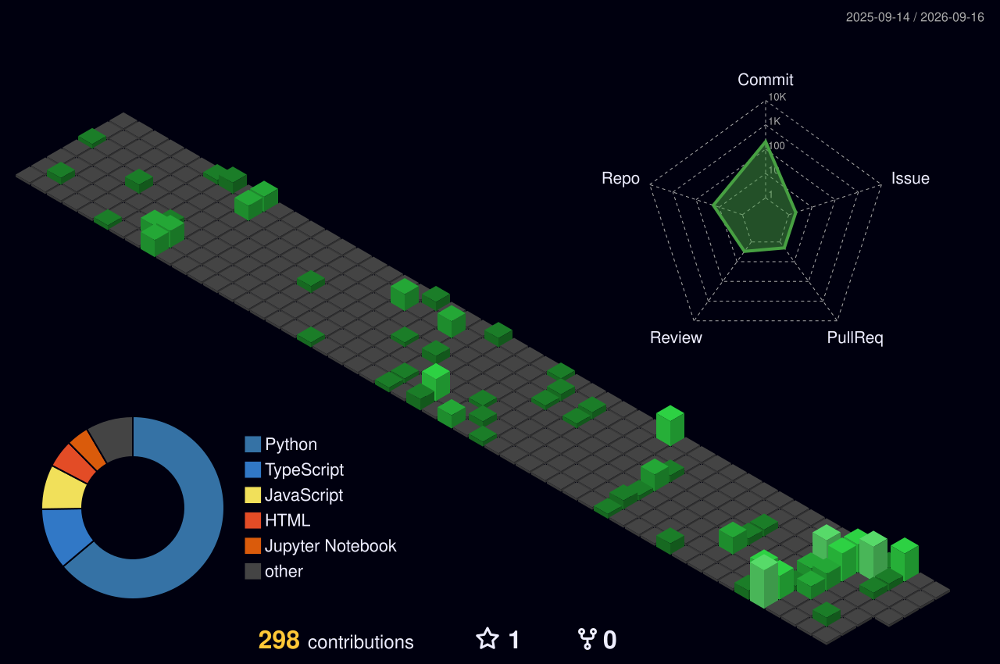

  

  
  
  

 

## 👨‍💻 About Me

I don't just build individual components—I enjoy connecting the pieces and turning an idea into a complete working system. While I utilize frontend development when required to bring products to life, my true passion lies in Machine Learning integration, Embedded Systems, IoT, hardware-software integration, and taking projects from experimental research to full end-to-end implementation. 

* 🚀 **Currently Exploring:** Advanced ML models and IoT sensor integrations.

## 🏗️ What I Build

* 🧠 **AI/ML Systems:** Developing and integrating models for real-world data processing and automation.
* 🔌 **Embedded & IoT:** Connecting the physical world to software through microcontrollers and sensors.
* 🔬 **Research & Experimentation:** Exploring new architectures and emerging technologies.
* 🛠️ **End-to-End Solutions:** Architecting hardware-software workflows from the ground up.

## 🛠️ Tech Stack

  

## 🚀 Featured Projects

| Project | Description | Tech Stack |
| :--- | :--- | :--- |
| 🏥 [**Healthcare-Assistant**](https://github.com/Nikheel108/Healthcare-Assistant) | Python-based healthcare assistant utilizing ML and automation. |  |
| 🏙️ [**Quantum-Computing-for-Smart-Cities**](https://github.com/Nikheel108/Quantum-Computing-for-Smart-Cities) | Exploring quantum computing applications for smart city infrastructure. |  |
| 📜 [**certificate-video**](https://github.com/Nikheel108/certificate-video) | Tool for programmatically generating certificate videos. |  |
| 🧮 [**Calculator**](https://github.com/Nikheel108/Calculator) | Interactive UI with standout visual effects. |  |

*(More IoT and Embedded projects coming soon!)*

## 📊 GitHub Stats & 3D Contributions

  
  
    
  

 

  <h3>🧊 3D Contribution Graph</h3>
  <!-- This image is generated automatically by a GitHub Action -->
  <picture>
    <source media="(prefers-color-scheme: dark)" srcset="profile-3d-contrib/profile-night-green.svg">
    <source media="(prefers-color-scheme: light)" srcset="profile-3d-contrib/profile-green-animate.svg">
    
  </picture>

## 📬 Let's Connect

  
  
  
  

 

  

